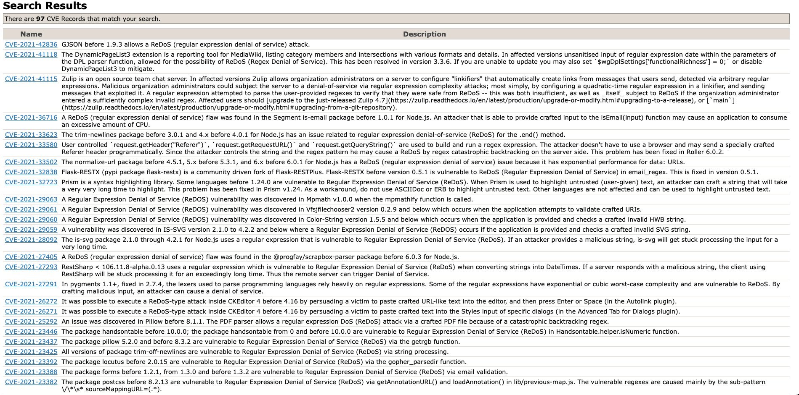
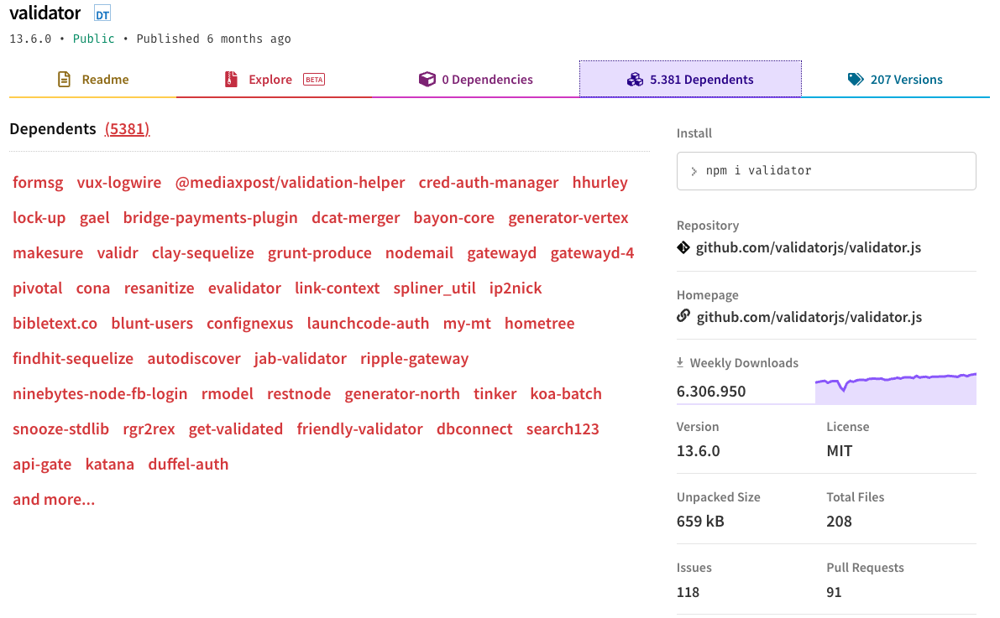

# ReDoS, negação de serviço com expressões regulares

## O que é uma expressão regular?

Uma expressão regular (regex) é uma sequência de caracteres que especificam um padrão de busca. É definida como uma [linguagem formal](https://pt.wikipedia.org/wiki/Linguagem_formal) e surgiu a partir dos estudos do matemático [Stephen Cole Kleene](https://pt.wikipedia.org/wiki/Stephen_Kleene).
## Onde são utilizadas expressões regulares?

Expressões regulares especificam padrões, então são bastante utilizadas para validar ou mesmo para extrair dados. Abaixo temos um exemplo de uma regex que identifica se um determinado texto contém um CPF:

\d{3}\.\d{3}\.\d{3}\-\d{2}

O padrão que a regex acima expecifica é de três dígitos seguido de um ponto, depois mais três dígitos seguidos de outro ponto, depois mais três dígitos seguidos de um traço e por fim seguidos de dois dígitos.

```
/\d{3}\.\d{3}\.\d{3}\-\d{2}/.test('Meu CPF é 000.000.000-00')
```

O retorno do código acima será true, pois o padrão `\d{3}\.\d{3}\.\d{3}\-\d{2}`, foi identificado no texto `Meu CPF é 000.000.000-00`.

Expressões regulares também podem ser utlizadas para extrair dados de um texto, a regex `\D+`, pode ser usada para extrair todos os dígitos de uma determinada string, da seguinte forma:

```
'Meu CPF é 000.000.000-00'.replace('\D+', '')
```

O retorno do código acima será: 00000000000

A regex `\D+` especifica o padrão de tudo que não for dígito que tem um tamanho de pelo menos um e de no máximo n caracteres.

As regex podem ser e são utilizadas em uma variadade de contextos, desde de validação de dados até softwares como editores de textos, IDEs, compiladores, scrapping e inúmeras outras utilidades.

## O que é um ataque ReDoS?

ReDoS ([CWE-1333](https://cwe.mitre.org/data/definitions/1333.html)) é o acrônimo de Regular Expression Denial of Service, o que pode ser traduzido em Ataque de Negação de Serviço de Expressão Regular.
É um ataque que afeta a disponibilidade de um sistema, ele é viável devido a implementação de alguns algoritmos de análise de expressões regulares, 
que possuem uma complexidade algorítmica exponencial no pior caso. Sendo assim uma falha de ReDoS explorada com sucesso pode fazer com que um
sistema demore tempo demais para analisar uma expressão regular e consuma muito recurso de processamento, deixando o sistema lento ou até mesmo 
inviabilizando o serviço.

## Como funciona um ataque ReDoS?

Algumas implementações de algoritmos de interpretação de expressões regulares utilizam uma técnica chamada [backtracking](https://pt.wikipedia.org/wiki/Backtracking), que é bastante utilizada
em algoritmos de busca. Utilizando essa técnica o algoritmo tenta encontrar todos os caminhos possíveis para um problema, em um determinado passo da busca caso ele não encontre nada, ele retorna ao estado de busca anterior e
tenta buscar por outro caminho, e continua fazendo esse processo até que todas as possibilidades tenham sido esgotadas. Abaixo temos alguns exemplos de expressões regulares que podem permitir um ataque ReDoS:

`(a+)+`

`(a|aa)+`

`^[\s]+|[\s]+$`

`^[\s\u200c]+|[\s\u200c]+$`

`([a-zA-Z]+)*`

`^(([a-z])+.)+[A-Z]([a-z ])+$`

`^([a-zA-Z0-9])(([\-.]|[_]+)?([a-zA-Z0-9]+))*(@){1}[a-z0-9]+[.]{1}(([a-z]{2,3})|([a-z]{2,3}[.]{1}[a-z]{2,3}))$`

`(?:(?:\"|'|\]|\}|\\|\d|(?:nan|infinity|true|false|null|undefined|symbol|math)|\|\-|\+)+[)]*;?((?:\s|-|~|!|{}|\|\||\+)*.*(?:.*=.*)))`

O problemas de todas essas regex acima são a ambiguidade, utilizam grupos com repetição ou alternância, e como dito anteriormente, dependendo do algorítimo que analise essas regex e do texto ao qual elas forem aplicadas, o seu sistema pode sofrer uma negação de serviço. 

## Estou vulnerável a esse tipo de ataque?

Agora que já vimos um pouco de teoria vamos para a parte prática. Já vimos o que são regex, como são processadas, quais as vulnerabilidades que pode ser exploradas, e alguns exemplos mais triviais. Mas será que essa falha pode ser explorar em um ambiente real, de produção, será se meu sistema tá vulnerável a esse tipo de ataque? Você pode perguntar ao [Cloudflare](https://blog.cloudflare.com/details-of-the-cloudflare-outage-on-july-2-2019/) ou ao [StackOverflow](https://stackstatus.net/post/147710624694/outage-postmortem-july-20-2016), que tiveram seus serviços interrompidos e na análise post mortem, foi identificado que a causa da interrupação foram falhas de ReDoS. 

Mas vamos tentar encontrar outras referências dessa falha, o [banco de dados da CVE](https://cve.mitre.org/) pode ser um bom ponto de partida e uma rápida pesquisa sobre ReDoS trouxe os seguinte resultados:



97 ocorrências de falhas ReDoS reportadas, em diversos tipos de linguagens e bibliotecas.

E, obviamente, essa lista não está atualizada, pois a falha que irei utilizar como exemplo não está no resultado da busca. Veremos abaixo alguns softwares que tiveram falhas reportadas de ReDoS, mas não foram catalogadas com seu CVE, e, se você estiver utilizando alguma versão que listarei abaixo sugiro atualizar o seu ambiente o quanto antes:

* A biblioteca [validator.js](https://www.npmjs.com/package/validator) na versão 13.5.1 possui algumas falhas de ReDoS que foram prontamente [corrigida pelos seus mantenedores](https://github.com/validatorjs/validator.js/pull/1651), as validações [isEmail](https://github.com/validatorjs/validator.js/issues/1597) e [isHSL](https://github.com/validatorjs/validator.js/issues/1598) são as que estão vulneráveis.

* A biblioteca jsPDF na versão [2.3.1](https://github.com/parallax/jsPDF/commit/d8bb3b39efcd129994f7a3b01b632164144ec43e) está vulnerável a ReDoS.

* A biblioteca is-email na versão [1.0.0](https://github.com/segmentio/is-email/commit/060ecedf345729f11ad857ccaf7a915ff6797739) está vulnerável a ReDoS.

* A biblioteca js-xss na versão [1.0.9](https://snyk.io/vuln/SNYK-JAVA-ORGWEBJARSNPM-1759311) está vulnerável a ReDoS.

* O ORM Sequelize na versão [6.6.4](https://github.com/sequelize/sequelize/commit/5fa695fd4f81faeae3528bf4aae519dfd1e5b1ae) está vulnerável a ReDoS, por que utiliza o validator.js para fazer a validação de dados em seus modelos.

Na verdade, todas as libs que utilizarem o validator.js na versão 13.5.1 estão possivelmente vulneráveis a esse ataque, caso utilizem alguma versão desatualizada desse pacote, a imagem abaixo mostra que existem atualmente 5381 pacotes dependentes do validator.js.


## Como posso previnir esse ataque?

Bem, sabendo que nunca estaremos 100% seguros e que tudo é uma questão de mitigar riscos nós podemos seguir as seguintes recomendações:

* Evite criar regex por conta própria, prefira utilizar bibliotecas especializadas em validações, e mesmo com as falhas que apresentei aqui, utilizar essas bibliotecas é a melhor alternativa, pois existem
muitas pessoas empenhadas em melhorar e corrigir esses bugs nesse projetos. Lembre-se sempre da [Lei de Linus](https://pt.wikipedia.org/wiki/Lei_de_Linus): "Dados olhos suficientes, todos os erros são óbvios".

* Se for criar alguma regex por conta própria, se atente para não adicionar regex que possam levar a ambiguidade, evite grupos com repetições como por exemplo a regex `(a|aa)+`. Mais exemplos de padrões para se evitar em regex podem ser encontrados [aqui](https://www.regular-expressions.info/catastrophic.html) e [aqui](https://owasp.org/www-community/attacks/Regular_expression_Denial_of_Service_-_ReDoS).

* Como falado anteriormente ataques de ReDoS só são possíveis devido a implementações que utilizam backtracking ou alguma outra técnica de busca que se baseia nesse conceito.
Linguagens como Golang, Rust não utilizam esse tipo de algoritmo. Um exemplo de algoritmo que não utiliza backtrack é uma biblioteca [re2](https://www.npmjs.com/package/re2) criada pelo Google, e que possui wrappers em diversas linguagens.

* Projetos como o [vuln-regex-detector](https://github.com/davisjam/vuln-regex-detector), escaneiam o seu código por expressões regulares mal feitas e que podem levar a um ataque ReDoS.

* Por último e não menos importate, sempre mantenha suas dependências atualizadas. (Regra de ouro)

## Referências

https://en.wikipedia.org/wiki/Regular_expression

https://www.regular-expressions.info/catastrophic.html

https://levelup.gitconnected.com/the-regular-expression-denial-of-service-redos-cheat-sheet-a78d0ed7d865

https://lirantal.medium.com/node-js-pitfalls-how-a-regex-can-bring-your-system-down-cbf1dc6c4e02

https://owasp.org/www-community/attacks/Regular_expression_Denial_of_Service_-_ReDoS